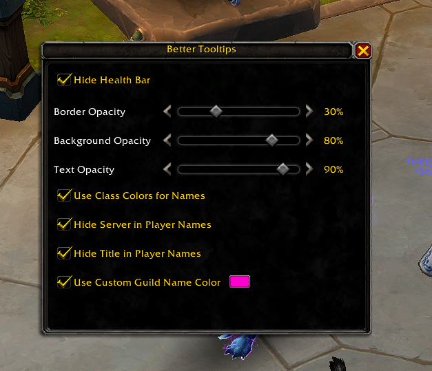

# BetterTooltips

A World of Warcraft addon that lets you customize the default tooltip.

## Features

- Hide health bar
- Border opacity
- Background opacity
- Text opacity

## Usage

Type `/bt` to open the configuration window.

## Installation

1. Download the latest release
2. Extract the `BetterTooltips` folder to your `Interface/AddOns` directory

## Links

- https://www.curseforge.com/wow/addons/better-tooltips

## License

BetterTooltips is released under the GPL-3.0 License. For more details, see the LICENSE file.
